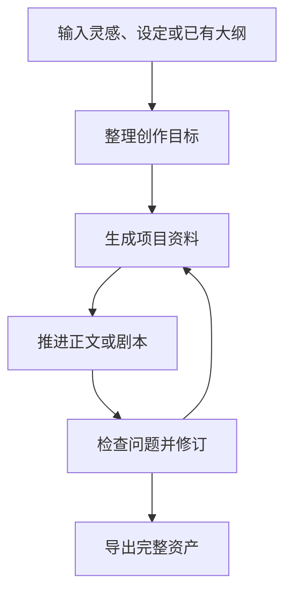
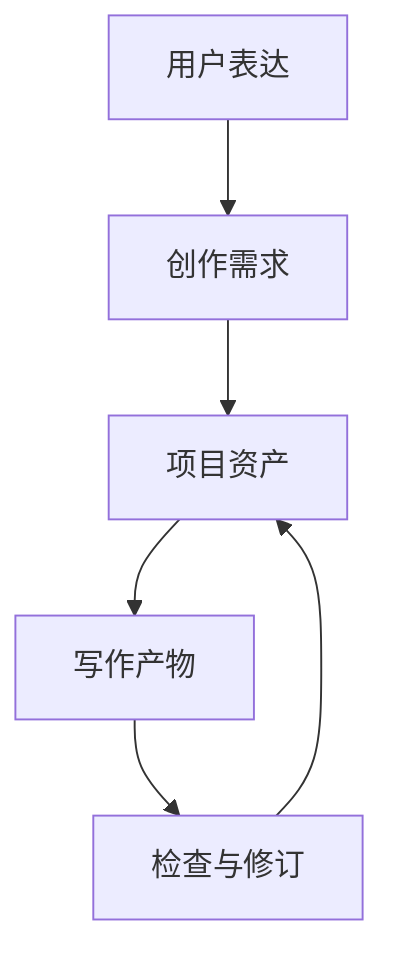
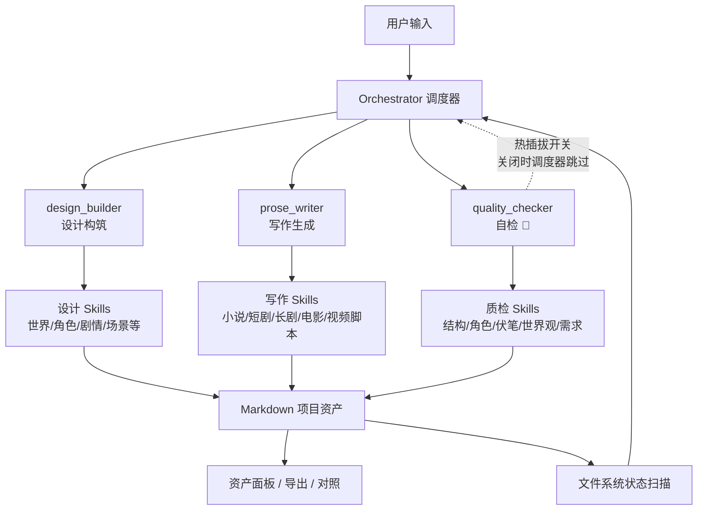

把一个故事想法，推进成可以持续创作、检查和导出的小说或剧本项目。

## 它解决什么问题

写长故事的人和写短内容的人面对的是完全不同的困难。

写一则短篇，你可以靠状态撑下来：脑子里装着全部设定、记得每一处伏笔、知道接下来要写什么。但长篇不行——一部小说或剧本动辄几百页，创作周期横跨数周甚至数月。你不可能靠记忆维持一致性。

你会遇到这些事：

- 前几章埋的伏笔，到后面忘了收。
- 角色的性格写到后面跑偏了，和前面矛盾。
- 更新了一版设定，但前面那几章已经按旧设定写完了。
- 有很多点子，但不知道从哪个开始落地。
- 写完之后想整体检查一遍，发现散落在几十个文件里，拼不到一起。

这些问题的根源是一样的：**创作素材散落在聊天记录、文档草稿和脑子里，没有一个统一的地方让它们彼此关联、持续演化。**

Charta 就是把这个问题解决掉。它不是帮你“生成一段文字”的工具——它是一个创作工作台，让你的想法、设定、角色、剧情资料、正文、检查报告都待在该待的地方，每一次修改都能被追踪，每一步推进都有据可查。

## 你用它的时候在想什么

| 你现在的处境 | 这时候你需要什么 |
|---|---|
| 有一个故事点子，但不知道怎么展开 | 帮我把灵感整理成清晰的创作目标和项目骨架，而不是直接给我生成一段不知道合不合适的正文 |
| 攒了一堆设定、片段、人物关系，但没串起来 | 把这些碎片归纳成可以持续使用的资料，让我在后续创作中可以查看和引用 |
| 想写小说，但每次打开文档都不知道从哪接下去 | 让我能看到当前的结构、已写的内容，知道下一步该写什么 |
| 想写短剧/长剧/电影，但剧本有固定格式和节奏要求 | 帮我按对应行业规范组织内容，而不是输出一段两头不靠的文本 |
| 写到后面发现前面埋伏笔忘了收 | 帮我追踪伏笔状态，告诉我哪些已经回收、哪些还悬着 |
| 不知道当前的故事有没有问题 | 帮我检查设定一致性、角色行为逻辑、结构完整性和需求覆盖度 |
| 写完之后想带走 | 把整个项目导出成结构化 Markdown 或 Word，方便排版、投稿或协作 |

## 它怎么陪你创作

你不需要先学一套创作术语。直接说你想写什么、哪里不满意、想继续推进哪一部分就可以。



### 你可以这样开始

```text
我想写一个短剧：女主是被全网误解的天才医生，三年后回到医院复仇。整体节奏要爽，反派是她曾经最信任的导师。
```

```text
我有一个小说设定：一座城市每晚都会重置记忆，只有主角记得昨天发生过什么。帮我整理成可以继续写的项目。
```

```text
这是我已有的大纲，帮我整理并检查哪里不顺。
```

## 支持的创作方向

Charta 支持四种创作方向，各自对应不同的写作规范和输出形式。选定方向后，系统会按该方向组织规则——正文不会被写成剧本格式，剧本也不会被写成散文章节。

- **小说**：章节正文、叙述、心理描写、细腻场景
- **短剧**：高频冲突、强钩子、分集剧本
- **长剧**：多线推进、人物关系、分集剧本
- **电影**：场面段落、视觉表达、电影剧本

此外还支持从正文进一步衍生**视频脚本**（分镜/拍摄脚本），适用于需要将剧本转为拍摄方案的场景。

## 你带走的不是一段话，是一个项目

每一轮创作的结果都会保存成一组项目资产。这些资产独立于聊天记录存在：

创作需求 · 世界设定 · 角色设定 · 故事结构 · 关键剧情资料 · 小说正文或剧本 · 视频脚本 · 检查报告 · 可导出的 Markdown 或 Word 文件包

你可以查看、对照历史版本、导出存档，也可以在下一轮创作中继续派上用场。

## 页面能力

| 模块 | 作用 |
|---|---|
| 对话区 | 用自然语言提出创作需求、修改意见或检查请求 |
| 资产栏 | 查看项目中已经生成的需求、设定、角色、剧本等资产 |
| 当前稿 | 阅读当前选中的资产内容 |
| 对照模式 | 查看修改前后的差异 |
| 执行日志 | 了解本轮系统调用了哪些能力、写入了哪些资产 |
| 自检 | 检查项目资料是否一致、需求是否被满足 |
| 导出 | 将项目资产按类型整理后导出 |
| 设置 | 配置模型服务、查看或扩展创作规则 |

---

## 产品设计思考

这一节解释 Charta 为什么设计成这样。如果你只想用，可以跳过；如果你想理解背后的取舍，可以读一读。

### 资产驱动，不靠聊天记忆

长篇创作最怕两件事：前面说过的设定忘了，后面写出来的内容和前面打架。

ChatGPT 式的对话产品面对这个问题几乎无解——聊天历史越长，模型注意力越分散，上下文窗口总有到头的时候。你不可能靠翻前面的聊天记录来维持一致性。

Charta 换了一种思路：**把创作过程拆成资产，而不是对话内容。**


---

## 技术架构

Charta 采用三层调度模型：Orchestrator 理解用户意图并选择能力，Subagent 承接一类创作方向，Skill 定义具体读写规则。分层调度把"用户想要什么"和"本轮具体写哪个文件"分开处理。渐进式披露机制参考了 Claude 的 Skill 设计——Subagent 启动后按需读取规则，不一次性灌注全部上下文。

9.0 的核心结构如下：



三类核心能力：

- **design_builder**：处理需求整理、世界观、角色、剧情结构、序列/场景/节拍草案等设计资产。设计期不再把多个能力暴露成独立工具，用户只需提出设计需求，系统内部选择最小必要 Skill。
- **prose_writer**：根据产品方向（小说/短剧/长剧/电影）选择对应写作规则，产出正文或剧本。非小说方向还可衍生视频脚本。
- **quality_checker**：检查需求覆盖、结构一致性、角色一致性、世界观一致性和伏笔回收。支持运行时开关——关闭后不进入调度器工具列表，不会消耗额外调用。

## 项目资产

项目内容以 Markdown 资产组织，便于查看、版本对照和导出。

```text
assets/
  user_requirements.md
  worldbuilding.md
  characters.md
  act_map.md
  sequence_list.md
  foreshadowing.md
  subplots.md
  sequences/
  scenes/
  beats/
  novel_chapters/
  short_drama_scripts/
  long_drama_scripts/
  film_scripts/
  video_scripts/
```

资产文件既是界面展示内容，也是后续创作的上下文来源。它们做对了，项目就能持续推进；它们散乱了，项目就会停滞。这是把"资产"而不是"对话"作为项目核心的原因。

## 工程结构

```text
charta/
  server/                 后端服务：API、项目存储、导入导出、配置管理
  web/                    前端工作台：界面、状态、调度引擎、创作规则
    src/
      api/                前端请求层
      components/         页面和交互组件
      orchestrator/       调度引擎、上下文组装、输出校验
      skills/             Subagent 与 Skill 定义
      store/              Zustand 状态管理
      types/              类型与产品档案
  project_summary_8.0/    旧版项目说明
  project_summary_9.0/    当前最终版 README
```

### 本地部署

**环境要求**：Node.js 18+

**安装依赖**：
```bash
npm install
```

**启动开发环境**：
```bash
npm run dev
```
开发模式同时启动前端（Vite，`http://localhost:5173`）和后端（Express，`http://localhost:3001`）。

**生产构建**：
```bash
npm run build
```

**启动生产服务**：
```bash
npm start
```
生产模式下后端托管前端构建产物，通过同一个端口提供页面和 API。

**类型检查**：
```bash
npx tsc -b
```

## 技术栈

| 部分 | 技术 |
|---|---|
| 前端 | Vite 5、React 18、TypeScript 5、Zustand |
| Markdown 渲染 | react-markdown、remark-gfm |
| 差异对比 | diff |
| 后端 | Node.js、Express |
| Word 导入导出 | mammoth、turndown、docx |
| 模型接口 | OpenAI 兼容接口，支持 Function Calling |

## 已知限制

- 自动化测试覆盖还不完整。核心调度逻辑和资产校验链路经过多轮人工测试，但缺少持续集成的自动化回归保障。
- 超长项目的上下文压缩仍有继续优化空间。虽然采用渐进式披露和多轮隔离上下文来缓解，但极长流程（数十个序列）下上下文管理仍可能成为瓶颈。
- `design_builder` 统一设计入口仍需要继续打磨 Skill 选择、日志展示和缺上游时的降级策略。
- 质检报告持久化、批量任务恢复、写作前完整性检查还有进一步产品化空间。

