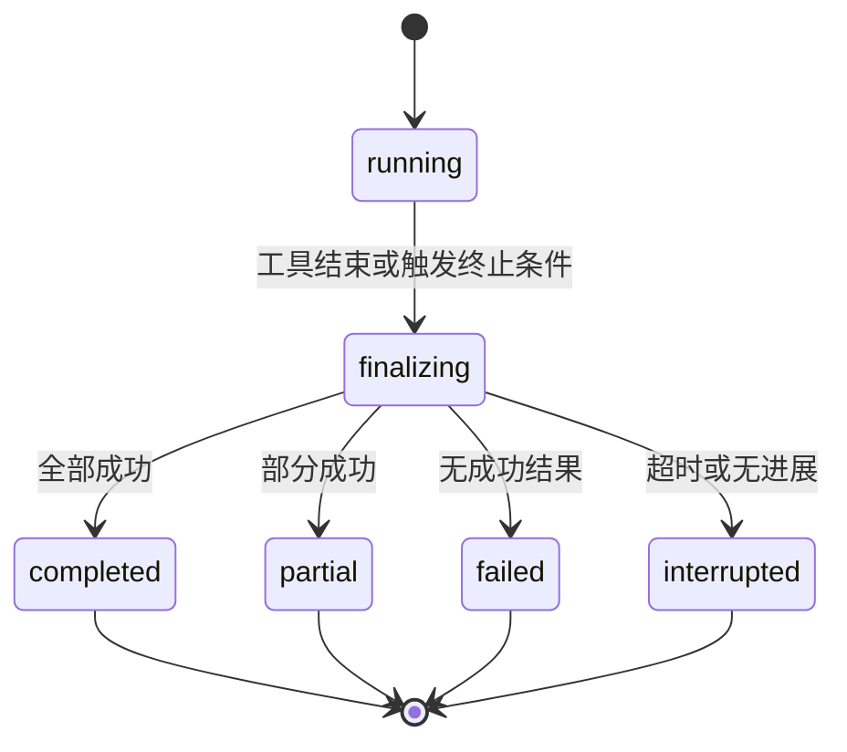

# StoryCrafter v7.4 对话执行收口优化设计

## 1. 背景

当前用户发送创作指令后，页面会持续展示 Orchestrator 和 Subagent 的执行日志。资产可能已经成功写入，但用户经常看不到一条清晰的最终回复，不知道本轮完成了什么、哪些内容失败、是否还需要继续操作。

这不是单一文案问题，而是执行生命周期缺少强制收口：

- 最终回复依赖 Orchestrator LLM 主动返回 `finish_reason: stop`。
- 模型可以连续调用工具，主循环的安全上限高达 100 轮。
- 没有重复工具调用、连续无进展和整轮耗时检测。
- `ToolResult` 中已有真实的成功状态、写入路径和警告，但没有被机械汇总成用户结果。
- `ExecutionLogCard` 固定渲染在全部消息之后，导致最终回复即使生成，也会出现在日志上方。
- `engine_complete` 在需求状态后处理完成前发出，界面显示“完成”时后台可能仍在工作。
- `chatStore` 要等待全量资产刷新后才添加系统回复，进一步拉长日志结束到结果出现之间的空窗。

因此 v7.4 需要建立“一次用户输入必有一个可见结果”的产品与技术约束。

## 2. 目标

### 2.1 用户目标

每次发送消息后，用户最终都能看到一条位于本轮日志下方的结果回复，明确说明：

- 本轮整体状态：完成、部分完成、失败或中止。
- 实际执行了哪些能力。
- 新增或更新了哪些资产。
- 哪些任务失败或产生警告。
- 用户下一步可以做什么。

### 2.2 系统目标

- 最终结果不依赖 LLM 自觉总结，由引擎根据真实执行结果确定性生成。
- 工具链不能无限运行；重复调用、无进展和超时都能自动结束。
- 日志、结果与持久化按同一个 turn 组织，不再依赖全局临时数组推断顺序。
- 任意退出路径都满足“一轮一结果”，包括异常、限流、内容过滤、响应截断和页面恢复。

## 3. 非目标

- 本专项不修改具体故事生成 Skill 的内容质量。
- 不把执行日志替换为自然语言直播；日志仍然是结构化过程信息。
- 不让 LLM 判断资产是否真的写入，写入结果仍以 FileManager 和 `ToolResult` 为准。
- 不在总结中展示模型推理过程。
- 不承诺一次用户输入完成无限量创作任务；超出预算时应部分完成并明确提示继续。

## 4. 核心产品原则

### 4.1 一轮一结果

每个用户消息创建一个独立 `turnId`。该 turn 最终必须产生且只产生一条结果消息。

允许的终态：

| 状态 | 含义 | 用户文案方向 |
|---|---|---|
| `completed` | 所有已执行任务成功 | 本轮已完成 |
| `partial` | 有成功写入，也有失败、警告或预算中止 | 本轮部分完成 |
| `failed` | 没有任何有效写入且发生失败 | 本轮未完成 |
| `interrupted` | 超时、重复调用或无进展被系统终止 | 本轮已中止 |

### 4.2 事实优先

结果总结的数据优先级：

1. FileManager 实际写入结果。
2. `ToolResult.success/writes/warnings/error`。
3. ExecutionEvent 中的工具名称与步骤状态。
4. LLM 最终文本，仅作为补充说明。

LLM 文本不得覆盖或否定机械事实。例如工具返回失败时，模型不能在结果中宣称“已完成”。

### 4.3 先展示结果，再做非关键后台工作

需求状态标记、项目 metadata 更新等非关键收尾不得阻止用户看到本轮结果。需要严格一致的数据更新应进入 `finalizing` 阶段，并设置独立超时。

## 5. 用户界面设计

### 5.1 正确的时间线顺序

每轮固定按以下顺序展示：

1. 用户消息。
2. 本轮执行日志。
3. 本轮结果消息。

处理中：

```text
用户：完善第一幕

执行日志（展开）
  正在更新幕结构…
  正在构筑 S1-1…

创作中…
```

完成后：

```text
用户：完善第一幕

执行日志（折叠）
  已完成 2/2 个步骤 · 用时 48 秒

系统：本轮已完成
  - 更新了幕结构
  - 新增序列 S1-1
  - 写入 act_map.md、sequences/S1-1.md
```

### 5.2 结果消息格式

结果消息由固定结构生成：

```markdown
## 本轮已完成

- 完成：幕结构、细纲构筑
- 更新：`act_map.md`
- 新增：`sequences/S1-1.md`

下一步：可以继续生成 S1-1 的场景层。
```

部分完成示例：

```markdown
## 本轮部分完成

- 已完成：世界观、角色设定
- 未完成：S1-2 节拍生成失败
- 提示：短时间内触发模型限流，已有资产均已保存

下一步：可以单独重试 S1-2 的节拍层。
```

### 5.3 日志交互

- `running`：默认展开，显示当前步骤、完成数和耗时。
- `finalizing`：显示“正在整理本轮结果…”，不再显示“创作中”。
- 进入终态：自动折叠，只显示状态、步骤完成数和总耗时。
- 用户可手动重新展开查看详细过程。
- 自动滚动锚点指向结果消息，不指向日志卡底部。

### 5.4 长任务反馈

当单次任务超过 30 秒，日志头部显示当前阶段和已用时间，例如：

```text
正在构筑 3/8 个序列 · 已用时 1分12秒
```

超过软时限时提示：

```text
任务耗时较长，已完成的内容会被保留；达到本轮上限后系统将自动汇总。
```

### 5.5 日志对齐与日志视觉密度

执行日志属于系统过程反馈，视觉语义与系统回复一致，必须固定在对话栏左侧：

- 日志卡左边缘与系统消息气泡左边缘对齐。
- 卡片右侧保留缩进，不再使用左侧缩进形成右偏效果。
- 日志标题、步骤标题、调用原因和副标题全部左对齐。
- 头部的完成数量可以位于右侧，但不能改变整张日志卡的左对齐位置。
- 处理中呼吸灯与日志卡使用同一左侧基线。

执行日志卡片过高、字号偏大时会挤占对话框。本次只压缩工具调用日志卡，不缩放整个应用：

- `#root` 保持标准 `width: 100%; height: 100%`，避免 transform 后百分比高度链路在嵌入式浏览器中失真。
- 日志卡内部字号、padding、gap、图标和圆角约缩小三分之一。
- 日志卡仍保留对话栏可读宽度，避免宽度变窄导致文字换行、反而增加高度。
- 主工作区、资产栏、正文栏、设置页和分栏拖拽比例不参与缩放。

该调整只改变执行日志的视觉占用，不改变浏览器持久化数据、资产内容与导出内容。

## 6. Turn 状态模型

### 6.1 状态机



### 6.2 数据结构

建议新增：

```ts
type TurnStatus =
  | 'running'
  | 'finalizing'
  | 'completed'
  | 'partial'
  | 'failed'
  | 'interrupted'

interface TurnExecution {
  id: string
  userMessageId: string
  resultMessageId?: string
  status: TurnStatus
  startedAt: number
  finishedAt?: number
  events: ExecutionEvent[]
  summary?: TurnSummary
}

interface TurnSummary {
  status: Exclude<TurnStatus, 'running' | 'finalizing'>
  completedTools: Array<{
    id: string
    name: string
    writes: string[]
  }>
  failedTools: Array<{
    id: string
    name: string
    error: string
  }>
  warnings: string[]
  createdPaths: string[]
  updatedPaths: string[]
  stopReason?: 'normal' | 'timeout' | 'no_progress' | 'duplicate_call' | 'round_limit'
  assistantNote?: string
  startedAt: number
  finishedAt: number
}
```

`createdPaths` 与 `updatedPaths` 需要在执行前读取资产存在状态，不能只根据路径名称猜测。

## 7. 引擎收口设计

### 7.1 确定性总结器

新增纯函数 `buildTurnSummary()`：

```ts
function buildTurnSummary(input: {
  toolCalls: ExecutedToolCall[]
  toolResults: ToolResult[]
  assetsBefore: Set<string>
  stopReason: TurnSummary['stopReason']
  assistantNote?: string
  startedAt: number
  finishedAt: number
}): TurnSummary
```

状态判定：

- 成功结果数量大于 0，且没有失败/警告/非正常终止：`completed`。
- 成功结果数量大于 0，同时存在失败、警告或非正常终止：`partial`。
- 没有成功结果，终止原因是超时、无进展、重复调用或轮次限制：`interrupted`。
- 没有成功结果且工具或模型报错：`failed`。

### 7.2 统一 finalizeTurn

所有 return 和 catch 都必须经过同一个 `finalizeTurn()`，禁止在各分支手写不同回复：

```ts
async function finalizeTurn(reason: StopReason, assistantNote?: string) {
  state.status = 'finalizing'
  emit('engine_finalizing', { message: '正在整理本轮结果…' })

  const summary = buildTurnSummary({
    toolCalls: state.executedCalls,
    toolResults: state.toolResults,
    assetsBefore: state.assetsBefore,
    stopReason: reason,
    assistantNote,
    startedAt: state.startedAt,
    finishedAt: Date.now(),
  })

  emit('engine_complete', {
    message: formatSummaryHeadline(summary),
  })

  return {
    success: summary.status === 'completed' || summary.status === 'partial',
    results: state.toolResults,
    response: renderTurnSummary(summary),
    summary,
  }
}
```

以下退出路径全部改走该函数：

- `finish_reason: stop`
- `finish_reason: length`
- `finish_reason: content_filter`
- 未知 finish reason
- LLM 请求异常
- 工具执行异常
- 主循环达到轮次上限
- 整轮超时
- 重复调用或连续无进展

### 7.3 模型最终文本的用途

当模型返回 stop：

- `message.content` 保存为 `assistantNote`。
- 机械结果摘要始终位于前面。
- assistantNote 只在非空且不与事实冲突时追加到“补充说明”。
- 不再使用 `message.content || '处理完成'` 作为完整回复。

## 8. 防止无限执行

### 8.1 业务轮次上限

- 主 Orchestrator 正常业务上限建议为 10 轮。
- 保留更高的内部安全阀没有产品意义，应删除或只作为不可达的崩溃保护。
- 达到上限后保留已完成资产，状态为 `partial` 或 `interrupted`。

### 8.2 连续无进展检测

定义“进展”为以下任一事件：

- 新增成功写入路径。
- 已存在路径内容发生变化。
- 首次完成一个此前未成功的工具目标。

连续 2 个 Orchestrator 轮次没有进展时终止，原因记为 `no_progress`。

### 8.3 重复调用检测

为每个工具调用生成签名：

```ts
signature = `${toolId}:${normalizedTarget}:${hash(normalizedInstruction)}`
```

同一 turn 内：

- 完全相同签名成功后再次出现：不重复执行，向模型返回“该任务本轮已完成”。
- 相同签名连续失败两次：停止自动重试并进入部分完成或失败总结。
- instruction 仅有空格、标点或同义前缀差异时，应先归一化再计算签名。

### 8.4 时间预算

建议预算：

| 层级 | 软限制 | 硬限制 | 行为 |
|---|---:|---:|---|
| 单次 LLM 请求 | 60 秒 | 120 秒 | 超时并允许有限重试 |
| 单个 Subagent | 120 秒 | 180 秒 | 保留已有写入并返回失败 |
| 整个用户 turn | 3 分钟 | 5 分钟 | 软限制提示，硬限制强制总结 |

通过 `AbortController` 传递取消信号，避免 UI 已经结束后后台请求继续写入。

### 8.5 批量任务

- 批量任务必须持续报告 `完成数/总数`。
- 并发上限从当前 50 收敛到 3～5，避免大量请求同时等待造成“日志一直动但没有结果”。
- 单个序列失败不阻断其余序列；最终统一列入 failedTools。

## 9. 收尾时序

当前 `engine_complete` 发送过早。调整后的顺序：

1. 完成最后一个工具调用。
2. 进入 `finalizing`。
3. 更新需求状态标记，设置独立短超时；失败只记 warning。
4. 构建 TurnSummary。
5. 返回 `DispatchResult`。
6. chatStore 立即添加并持久化结果消息。
7. 折叠本轮日志并滚动到结果。
8. 异步刷新未被 tool event 精准刷新的资产。
9. 异步持久化产品与 phase metadata。
10. 发出 UI 终态；不得在结果之后继续追加本轮工具事件。

关键原则：资产兜底全量刷新和 metadata 更新失败，不应吞掉已经生成的用户结果。

## 10. ChatStore 改造

### 10.1 从全局日志改为按 turn 保存

当前只有一份 `executionLog`，新一轮开始就清空。建议改为：

```ts
turns: Record<string, TurnExecution>
activeTurnId: string | null
```

事件进入当前 turn，历史 turn 的日志保持可查看，并与对应用户消息和结果消息绑定。

### 10.2 最终回复保险

`sendMessage()` 维护 `resultDelivered`：

```ts
let resultDelivered = false

try {
  const result = await engine.processUserInput(...)
  appendResultMessage(result.response)
  resultDelivered = true
} catch (error) {
  appendResultMessage(renderUnexpectedFailure(error))
  resultDelivered = true
} finally {
  if (!resultDelivered) {
    appendResultMessage('本轮执行已结束，但未取得完整结果。已完成的资产均已保留。')
  }
  finishTurn()
}
```

该保险只处理程序级意外；正常异常仍由 `finalizeTurn()` 生成更具体的总结。

### 10.3 回复优先级

引擎返回后先插入结果消息，再进行非阻塞的兜底刷新。tool event 已经对 `event.writes` 做精准刷新，因此没有必要让全量刷新阻塞最终回复。

## 11. ChatHistory 改造

不再采用“先 map 所有 messages，再统一渲染一张当前日志卡”的结构。

推荐把对话渲染为 Turn：

```tsx
{turns.map((turn) => (
  <TurnView key={turn.id}>
    <MessageBubble message={turn.userMessage} />
    <ExecutionLogCard turn={turn} />
    {turn.resultMessage && <MessageBubble message={turn.resultMessage} />}
  </TurnView>
))}
```

对于迁移前的历史普通消息，可以继续按原气泡顺序渲染；新 turn 使用结构化布局。

## 12. 持久化设计

### 12.1 聊天记录

结果消息继续进入现有 chat 持久化，保证服务重启后仍能看到“本轮完成了什么”。

### 12.2 执行 turn

建议新增每项目 turn 记录：

```text
server/data/projects/<id>/turns.jsonl
```

每行保存一个已完成 TurnExecution 的精简版本：

- turn ID
- userMessageId/resultMessageId
- 终态与起止时间
- 工具名称、写入路径、错误和 warning
- stopReason

不保存完整 LLM system prompt、API Key 或模型隐式推理。

### 12.3 重启恢复

若启动时发现存在没有终态的 running turn：

- 将其标记为 `interrupted`。
- 根据已持久化事件生成一条“上次执行因服务中断停止”的结果消息。
- 不自动恢复工具调用，避免重复写入。

## 13. 错误与结果矩阵

| 场景 | 最终状态 | 必须展示 |
|---|---|---|
| 所有工具成功 | completed | 工具与写入资产 |
| 部分工具成功 | partial | 成功项、失败项、下一步 |
| 首个工具即失败 | failed | 失败原因和可重试建议 |
| 模型响应 length | partial/interrupted | 已保存内容、截断原因 |
| content_filter | partial/failed | 已保存内容、调整表达建议 |
| 连续无进展 | interrupted | 已完成项、停止原因 |
| 重复工具调用 | partial/interrupted | 已完成项、阻止重复说明 |
| 达到时间预算 | partial/interrupted | 已保存内容、可继续入口 |
| 状态后处理失败 | completed/partial | 主任务结果 + 非阻塞 warning |
| 资产刷新失败 | completed/partial | 主任务结果 + 建议刷新页面 |

## 14. 文件级改造清单

### 前端/引擎

- `web/src/types/index.ts`
  - 新增 TurnStatus、TurnSummary、TurnExecution。
  - DispatchResult 增加结构化 summary。
- `web/src/orchestrator/orchestratorEngine.ts`
  - 新增 finalizeTurn、进展检测、重复调用检测、时间预算。
  - 所有退出路径统一收口。
  - `engine_complete` 移到真正完成的位置。
- `web/src/orchestrator/turnSummary.ts`
  - 新增确定性总结构建与 Markdown 渲染纯函数。
- `web/src/orchestrator/agentLoop.ts`
  - 支持 AbortSignal、停止原因和合理轮次预算。
- `web/src/llm/client.ts`
  - 支持请求超时与 AbortSignal。
- `web/src/store/chatStore.ts`
  - 日志按 turn 组织。
  - 结果优先展示和 finally 保险。
- `web/src/components/BottomBar/ChatHistory.tsx`
  - 改为按 turn 渲染。
- `web/src/components/BottomBar/ExecutionLogCard.tsx`
  - 增加 finalizing、总耗时、完成数/总数与终态摘要。
- `web/src/components/BottomBar/ExecutionLogCard.module.css`
  - 日志卡固定左对齐，右侧保留缩进，内部文本统一左对齐，并将日志条内部视觉尺寸压缩约三分之一。
- `web/src/styles/global.css`
  - 保持 `#root` 标准满屏尺寸，避免页面下半屏露出背景板。
- `web/src/styles/layout.css`
  - 主应用容器继承根节点宽高。
- `web/src/pages/Settings/SettingsPage.module.css`
  - 设置页高度跟随根节点。
- `web/src/components/Layout/MultiColumnLayout.tsx`
  - 分栏拖拽按当前可见宽度计算比例。
- `web/src/components/BottomBar/TurnResult.tsx`
  - 可选：独立结果卡；若继续使用系统气泡，则无需新增。

### 后端

- `server/src/routes/llm.ts`、`server/src/services/llmProxy.ts`
  - 传递取消与超时语义。
- `server/src/routes/chat.ts`、相关存储服务
  - 增加 turn 精简记录或扩展现有 chat 格式。

## 15. 测试方案

### 15.1 单元测试

- 全成功 ToolResult 生成 completed 总结。
- 成功加失败生成 partial 总结。
- 无成功加超时生成 interrupted 总结。
- createdPaths/updatedPaths 分类正确。
- 重复调用签名归一化正确。
- 连续两轮无写入触发 no_progress。
- LLM 文本为空时仍有完整结果。

### 15.2 引擎测试

- stop、length、content_filter、异常、轮次限制全部经过 finalizeTurn。
- `engine_complete` 是本轮最后一个事件。
- engine_complete 后不再发生资产写入。
- 状态标记更新失败不影响主结果返回。
- AbortSignal 能停止仍在等待的 LLM 请求。

### 15.3 UI 测试

- 处理中日志位于用户消息下方。
- 完成后结果位于日志下方。
- 自动滚动到结果消息。
- 新一轮不会清除上一轮日志。
- 展开历史日志不会改变结果顺序。
- 异常路径仍出现结果消息。
- 日志卡始终左对齐，且与系统消息使用同一左侧基线。
- 1280×720、1440×900 和 1920×1080 下页面均铺满视口，无右侧/底部空白。
- 日志卡内部视觉占用约缩小三分之一，主页面其他模块不随之缩放。
- 刷新页面或重新打开项目后，已持久化的日志仍显示在对应对话轮次内。

### 15.4 端到端验收场景

1. 单工具快速成功。
2. 五个工具串行成功。
3. 批量序列部分失败。
4. 相同工具被模型重复调用。
5. 模型持续 tool_calls 不主动 stop。
6. LLM 请求超时。
7. 执行中重启服务。
8. 完成后切换项目再切回，结果与日志仍存在。

## 16. 验收标准

- 任意用户消息在终态后 500ms 内出现一条结果消息。
- 结果消息始终位于本轮日志下方。
- 100% 的引擎退出路径经过 `finalizeTurn()`。
- 不存在“日志显示已完成但仍等待未标记后台任务”的状态。
- 相同成功工具签名不会在同一 turn 内执行第二次。
- 连续两轮无进展会自动结束。
- 整轮执行不会超过配置的硬时限。
- 部分成功时，已写入资产不会回滚或被总结遗漏。
- 服务重启后仍可看到已持久化的最终结果。
- 用户不需要展开执行日志，就能理解本轮完成了什么。
- 执行日志在所有状态下保持左对齐。
- 执行日志卡视觉尺寸约为原来的 68%，且不影响主页面其他模块比例。
- 已写入 `execution_log.jsonl` 的日志带 `turnId` 后，刷新后可恢复到对应结果消息前。
- 主页面和设置页面均无缩放留白或内容裁切。

## 17. 推荐实施顺序

1. 新增 TurnSummary 与确定性 Markdown 总结器。
2. 将 Orchestrator 所有退出路径统一到 finalizeTurn。
3. 调整 engine_complete 与需求状态后处理时序。
4. 在 chatStore 增加 resultDelivered 保险并让结果优先展示。
5. 按 turn 重构 ChatHistory 与 ExecutionLogCard 顺序。
6. 增加重复调用、无进展、轮次和时间预算。
7. 增加 turn 持久化与重启中断恢复。
8. 补齐单元、UI 和端到端测试。

第一阶段完成 1～5 后，即可解决用户“只看到日志、看不到本轮结果”的主要困惑；6～8 用于消除无限执行和跨重启不完整状态。

## 18. 本轮落地记录

本次开发已完成 v7.4 的首轮可用闭环：

- 新增确定性 `TurnSummary` 与 Markdown 总结器，结果只以真实 `ToolResult` 为事实来源。
- Orchestrator 的正常结束、异常、响应过长、内容过滤、超时、无进展、重复调用和轮次上限统一进入 `finalizeTurn()`。
- 主循环限制为 10 轮，单轮最多调用 5 个工具；连续 2 轮无进展、相同成功调用再次出现或整轮超过 5 分钟时自动收口。
- 后端单次 LLM 上游请求增加 120 秒超时，配置探活增加 20 秒超时，避免网络请求无限等待。
- 每条用户消息生成 `turnId`；执行日志固定放在该轮结果前，`finally` 仍保留结果消息兜底。
- 结果先进入对话并结束处理态，全量资产刷新与项目 metadata 持久化不再延迟用户看到回复。
- 系统结果支持 Markdown 渲染；日志进入 `finalizing` 时显示“正在整理本轮结果…”，结束后展示完成数、失败数与耗时。
- 执行日志改为左对齐，并将日志条内部字号、间距、图标与圆角压缩约三分之一；主页面与设置页不再做全局缩放。

本轮暂未新增独立 `turns.jsonl`。现阶段通过已有聊天记录持久化结果消息，并复用 `execution_log.jsonl`：新写入的执行事件会携带 `turnId`，初始化时按 `turnId` 分组恢复到对应对话轮次内。旧版本已写入但缺少 `turnId` 的历史事件无法可靠归属到某一轮，仍按不可恢复处理。
