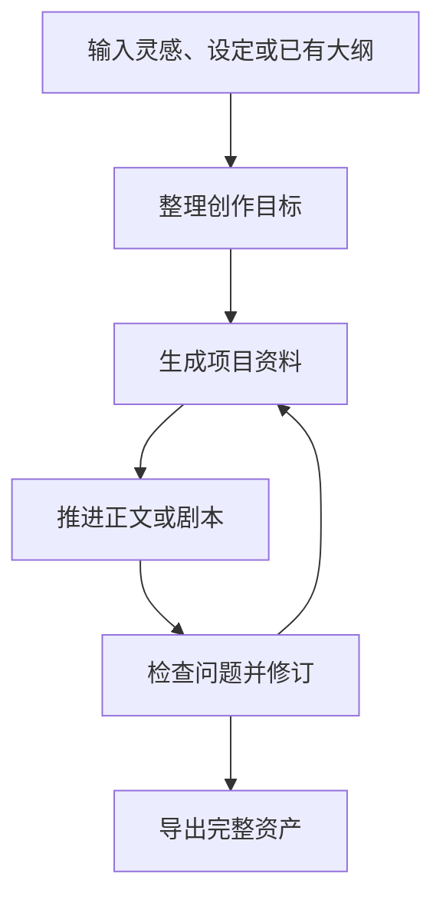
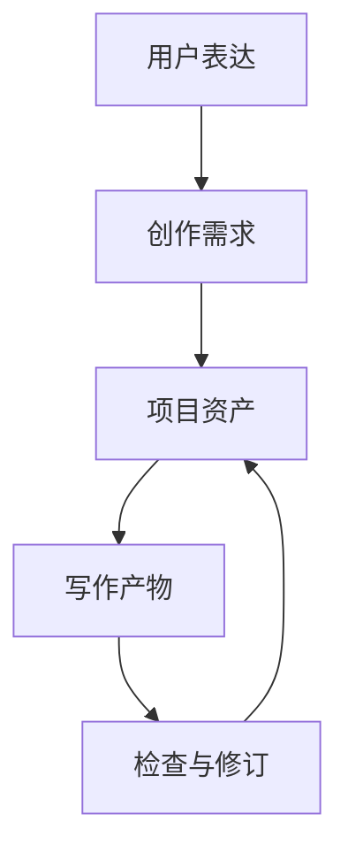
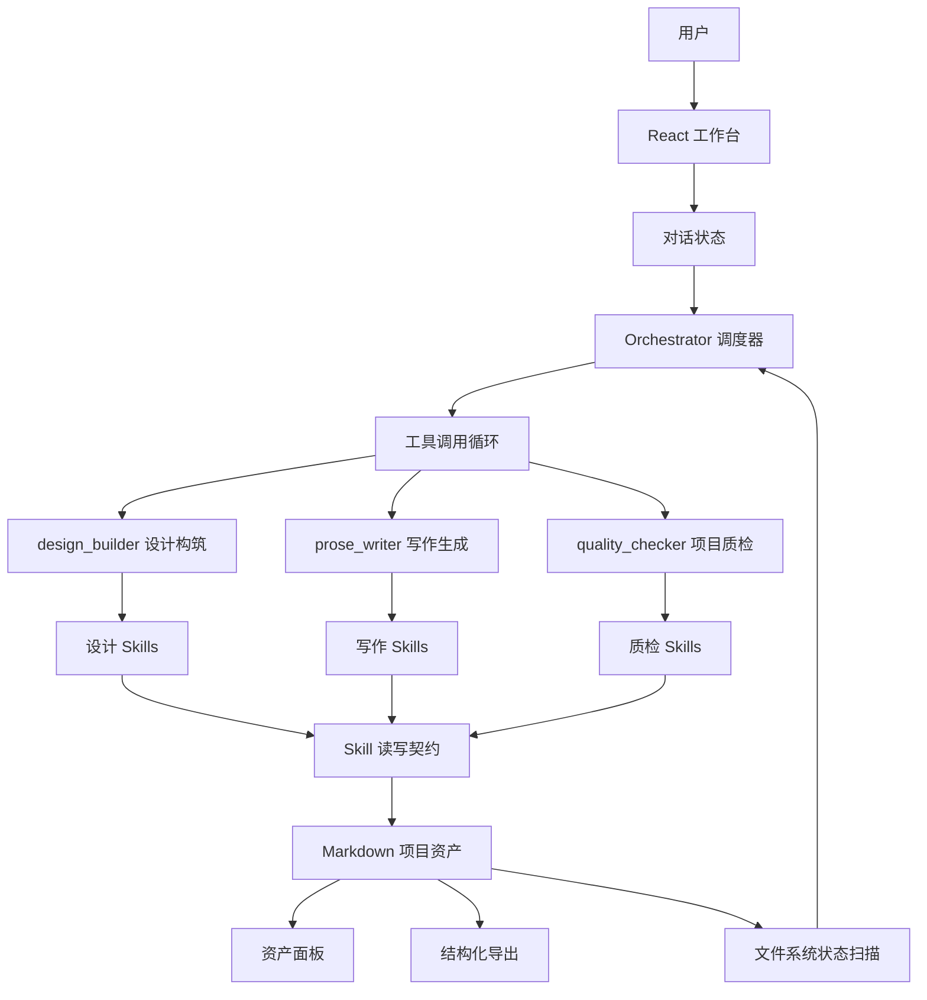
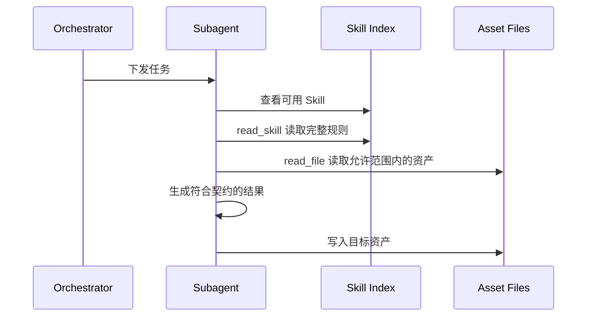
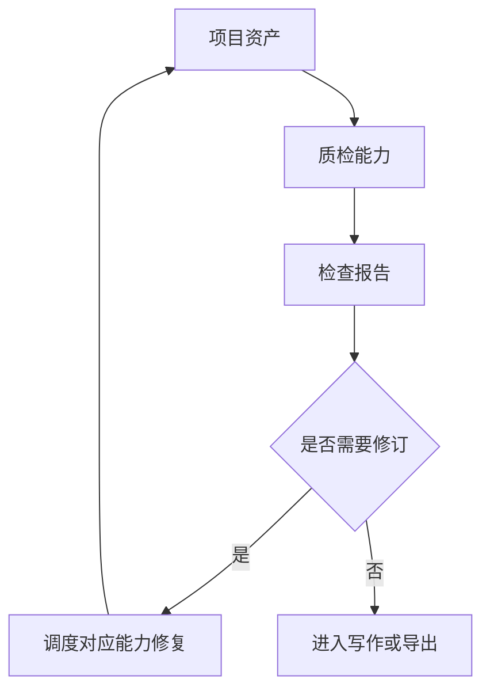

# StoryCrafter

把一个故事想法，推进成可以持续创作、检查和导出的小说或剧本项目。

StoryCrafter 是一个面向长篇创作的故事工作台。你可以从一句灵感、一个角色、一段设定或一份已有大纲开始，让系统帮你整理创作目标、沉淀项目资料、推进正文或剧本，并把每一步结果保存成可查看、可恢复、可导出的创作资产。

它不是一个“输入提示词，生成一段文字”的聊天框。它更像一张创作桌：想法、设定、角色、剧情资料、正文、检查报告都放在桌面上，后续每一轮创作都可以继续读取、修订和推进。

## 适合谁

- 有故事点子，但不知道怎么展开的人。
- 有很多设定、片段、人物关系，但还没有整理成项目的人。
- 想写小说、短剧、长剧或电影剧本的人。
- 希望系统持续记住项目资料、角色状态和前文设定的人。
- 想检查故事是否前后矛盾、伏笔是否丢失、最初需求是否被满足的人。
- 想把创作成果导出到 Markdown 或 Word，继续排版、投稿或协作的人。

## 它能帮你做什么

| 你的处境 | StoryCrafter 能做的事 |
|---|---|
| 我只有一个故事点子 | 把灵感整理成清晰的创作目标和项目资料 |
| 我有一堆碎片设定 | 归纳成可以持续使用的角色、世界和剧情资料 |
| 我想写小说 | 生成更适合阅读的章节正文 |
| 我想写短剧、长剧或电影 | 生成更接近剧本形态的内容 |
| 我怕系统忘记前情 | 把每一步结果保存成项目资产，后续继续读取 |
| 我不知道故事有没有问题 | 检查设定、角色、结构、伏笔和需求覆盖 |
| 我想带走成果 | 导出结构化 Markdown 或 Word 文件包 |

## 它怎么陪你创作



你不需要先学一套创作术语。直接说你想写什么、哪里不满意、想继续推进哪一部分就可以。

## 你可以这样开始

```text
我想写一个短剧：女主是被全网误解的天才医生，三年后回到医院复仇。整体节奏要爽，反派是她曾经最信任的导师。
```

```text
我有一个小说设定：一座城市每晚都会重置记忆，只有主角记得昨天发生过什么。帮我整理成可以继续写的项目。
```

```text
这是我已有的大纲，帮我整理并检查哪里不顺。
```

## 支持的创作方向

| 方向 | 适合产出 |
|---|---|
| 小说 | 章节正文、叙述、心理描写、细腻场景 |
| 短剧 | 高频冲突、强钩子、分集剧本 |
| 长剧 | 多线推进、人物关系、分集剧本 |
| 电影 | 场面段落、视觉表达、电影剧本 |

产品方向一旦选定，系统会按对应方向组织写作规则。小说不会被写成剧本，剧本也不会被写成散文化章节。

## 你会得到什么

StoryCrafter 会把创作过程保存成一组项目资产，例如：

- 创作需求
- 世界设定
- 角色设定
- 故事结构
- 关键剧情资料
- 小说正文或剧本
- 视频脚本
- 检查报告
- 可导出的 Markdown 或 Word 文件包

这些资产不是聊天记录的附属品，而是项目本身。你可以查看、对照、导出，也可以在后续创作中继续使用。

## 页面能力

| 模块 | 作用 |
|---|---|
| 对话区 | 用自然语言提出创作需求、修改意见或检查请求 |
| 资产栏 | 查看项目中已经生成的需求、设定、角色、剧本等资产 |
| 当前稿 | 阅读当前选中的资产内容 |
| 对照模式 | 查看修改前后的差异 |
| 执行日志 | 了解本轮系统调用了哪些能力、写入了哪些资产 |
| 自检 | 检查项目资料是否一致、需求是否被满足 |
| 导出 | 将项目资产按类型整理后导出 |
| 设置 | 配置模型服务、查看或扩展创作规则 |

## 本地部署

### 环境要求

- Node.js 18+
- npm

### 安装依赖

```bash
npm install
```

### 启动开发环境

```bash
npm run dev
```

开发模式会同时启动：

- 前端：Vite，默认 `http://localhost:5173`
- 后端：Express，默认 `http://localhost:3001`

### 生产构建

```bash
npm run build
```

### 启动生产服务

```bash
npm start
```

生产模式下，后端会托管前端构建产物，并通过同一个端口提供页面和 API。

### 类型检查

```bash
npm run typecheck
```

## 产品设计思考

### 资产驱动，而不是聊天驱动

长篇创作最怕两件事：前面说过的设定忘了，后面写出来的内容和前面打架。

StoryCrafter 的核心思路是把创作过程拆成资产。用户每轮输入会先被整理成创作目标，再由系统选择合适的能力写入对应资产。后续任务读取资产，而不是只依赖聊天历史。



这样做的好处很直接：

- 项目资料不会散落在聊天记录里。
- 用户可以明确看到系统改了什么。
- 后续写作可以读取已有资产继续推进。
- 长篇项目更容易维护一致性。

### 从“生成文本”到“维护项目”

普通写作工具往往把重点放在一段文本写得是否漂亮。StoryCrafter 更关心项目能不能持续往前走。

它会追踪：

- 用户最初提出过什么要求。
- 哪些资料已经生成。
- 哪些写作产物已经完成。
- 哪些地方可能存在矛盾。
- 本轮到底写入了哪些文件。

所以用户得到的不是一次性的回答，而是一套不断生长的创作项目。

### 用户语言优先，专业结构在系统内部处理

用户不需要理解内部创作层级。对用户来说，“帮我把这个角色写清楚”“这一段剧情不顺”“继续写剧本”才是自然语言。

系统内部会把这些请求映射到对应资产和专业规则，但不会要求用户先学会内部术语。这是产品体验和工程结构之间的分工：用户说人话，系统做拆解。

## 技术架构

StoryCrafter 的技术重点不是把模型接进页面，而是围绕长篇创作建立一套可调度、可校验、可恢复的资产系统。

9.0 的架构口径是三类核心能力：`design_builder` 负责设计资产，`prose_writer` 负责正文与剧本，`quality_checker` 负责质检。上游设计不再以多个入口暴露给用户，而是收敛到一个统一的设计构筑入口；具体做世界设定、角色、剧情资料还是场景草案，由内部 Skill 决定。



### Orchestrator / Subagent / Skill

系统采用分层调度模型：

| 层级 | 职责 |
|---|---|
| Orchestrator | 理解用户意图，选择能力，编排多步任务 |
| Subagent | 承接一类创作能力：`design_builder`、`prose_writer`、`quality_checker` |
| Skill | 定义具体专业规则、读写边界和输出格式 |
| Asset | 持久化项目内容，供后续任务继续读取 |

这套结构让系统可以把“用户想要什么”和“本轮具体该写哪个文件”分开处理。Orchestrator 负责判断方向，Skill 负责专业执行边界。

### 三类核心能力

| Subagent | 面向用户的含义 | 内部职责 |
|---|---|---|
| `design_builder` | 整理、补齐和修订项目资料 | 根据用户意图选择设计 Skill，处理需求、世界、角色、剧情资料、场景草案等设计资产 |
| `prose_writer` | 写小说正文或剧本 | 根据产品方向选择小说、短剧、长剧、电影或视频脚本规则 |
| `quality_checker` | 检查项目问题 | 检查需求覆盖、结构一致性、角色一致性、世界观一致性和伏笔回收 |

`design_builder` 的关键变化在于：设计期不再把多个设计能力暴露成一排工具。用户只需要提出设计诉求，系统内部再选择最小必要 Skill。这样既保留工程边界，又减少用户被前置流程卡住的感觉。

### 渐进式披露

系统不会一次性把所有规则、所有资产、所有上下文塞给模型。Subagent 启动时只看到轻量的 Skill Index；只有当它确定本轮需要某个 Skill 时，才读取完整规则。



这样可以减少上下文噪声，也让每次任务只暴露当前真正需要的规则。

### Skill Contract

每个 Skill 都声明自己的读写边界和输出格式。例如：

```yaml
reads: [sequences/<ID>.md, scenes/<ID>.md, characters.md]
writes: [beats/<ID>.md]
outputTags: ['<<<BEAT_LAYER_START>>>', '<<<BEAT_LAYER_END>>>']
```

引擎会根据当前 Skill 限制可读取文件，并在模型输出后做 TAG 校验，再写入目标资产。这能减少模型越权写入、输出格式漂移、资产混写等问题。

### 文件系统权威状态

项目状态不由模型根据聊天历史猜测，而是由引擎扫描资产文件生成。

比如“当前完成到哪一步”，系统会检查实际存在且非空的资产，而不是让模型凭记忆回答。Orchestrator 只拿到必要的状态快照；需要精确内容时，再通过读取工具渐进式查看对应资产。

这解决了一个很常见的问题：聊天说“完成了”不等于文件真的完成了。StoryCrafter 以文件为准。

### 一轮一结果

用户每发送一条消息，系统都会创建一个稳定的执行轮次。这个轮次包含：

```text
用户消息
→ 执行日志
→ 工具结果
→ 确定性摘要
→ 资产刷新
```

最终回复不完全依赖模型自己总结，而是根据真实 ToolResult 生成。即使中途有失败、警告或超时，用户也能看到本轮完成了什么、失败了什么、下一步该怎么继续。

### 执行日志恢复

执行日志会按轮次持久化。刷新页面或重开服务后，日志仍能回到对应对话记录里。用户看到的不只是结果，也能回看这个结果是由哪些能力、哪些资产写入组成的。

合并设计入口后，日志仍然可以显示当前使用的 Skill：

```text
调用：设计构筑
使用：场景层规则
目标：scenes/S1-1.md
```

这让系统既能保持入口简洁，也不会丢失执行透明度。设计入口收敛后，日志必须显示 Skill 名称，否则用户只会看到“设计构筑”这种过粗的过程描述。

### 多产品写作适配

写作层会根据项目选定的产品方向选择不同规则和输出目录。

| 产品方向 | 写作规则 | 输出资产 |
|---|---|---|
| 小说 | 小说正文规则 | `novel_chapters/` |
| 短剧 | 短剧剧本规则 | `short_drama_scripts/` |
| 长剧 | 长剧剧本规则 | `long_drama_scripts/` |
| 电影 | 电影剧本规则 | `film_scripts/` |
| 视频脚本 | 分镜 / 拍摄脚本规则 | `video_scripts/` |

同一个故事项目不会被统一写成一种泛化文本，而是按产品方向进入不同写作规范。

### 质检与修复闭环

质检能力会读取项目资产，检查需求覆盖、结构一致性、角色一致性、世界观一致性和伏笔回收。



质检不是单纯给建议，而是可以回流到调度器，由系统继续安排对应资产修订。

## 项目资产

项目内容以 Markdown 资产组织，便于查看、版本对照和导出。

```text
assets/
  user_requirements.md
  worldbuilding.md
  characters.md
  act_map.md
  sequence_list.md
  foreshadowing.md
  subplots.md
  sequences/
  scenes/
  beats/
  novel_chapters/
  short_drama_scripts/
  long_drama_scripts/
  film_scripts/
  video_scripts/
```

资产文件既是界面展示内容，也是后续创作的上下文来源。

## 工程结构

```text
storycrafter_3/
  server/                 后端服务：API、项目存储、导入导出、配置管理
  web/                    前端工作台：界面、状态、调度引擎、创作规则
    src/
      api/                前端请求层
      components/         页面和交互组件
      orchestrator/       调度引擎、上下文组装、输出校验
      skills/             Subagent 与 Skill 定义
      store/              Zustand 状态管理
      types/              类型与产品档案
  project_summary_8.0/    旧版项目说明
  project_summary_9.0/    当前最终版 README
```

## 技术栈

| 部分 | 技术 |
|---|---|
| 前端 | Vite 5、React 18、TypeScript 5、Zustand |
| Markdown 渲染 | react-markdown、remark-gfm |
| 差异对比 | diff |
| 后端 | Node.js、Express |
| Word 导入导出 | mammoth、turndown、docx |
| 模型接口 | OpenAI 兼容接口，支持 Function Calling |

## 已知限制

- 自动化测试覆盖还不完整。
- 超长项目的上下文压缩仍有继续优化空间。
- `design_builder` 统一设计入口仍需要继续打磨 Skill 选择、日志展示和缺上游时的降级策略。
- 质检报告持久化、批量任务恢复、写作前完整性检查还有进一步产品化空间。

## License

待补充。
